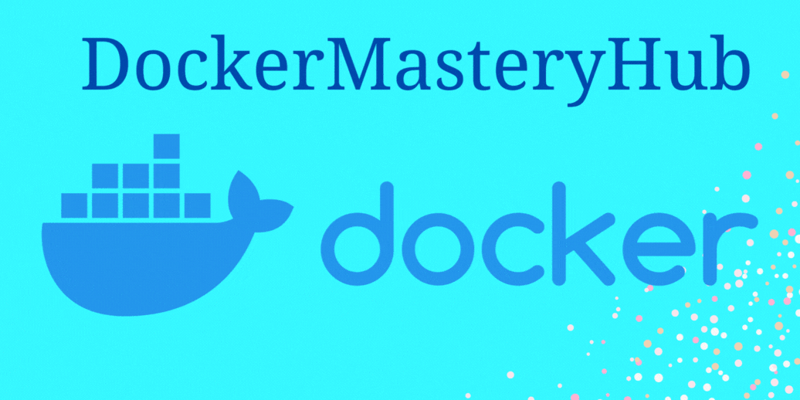

# Docker Learning Repository

Welcome to the Docker Learning Repository! This repository is designed to guide you through the fundamentals and advanced topics of Docker, helping you gain practical skills in containerization.

## Some learning repo

- https://github.com/collabnix/dockerlabs
  

## Basic Level Syllabus:

#### [1. Introduction to Docker](./1-Basic/01-Introduction-to-Docker.md)

- 1.1. What & Why of virtualization & containerization?
- 1.2. What is Docker.?
- 1.3. Docker Architecture and components
- 1.4. Docker Workflow

#### [2. Installing Docker & Basic commands](./1-Basic/02_Installing_Docker.md)

- 2.1. Installing Docker
- 2.2. Basic Docker commands and CLI usage

#### [3. Writing Dockerfiles and Building Images with Dockerfiles](./1-Basic/03_Writing_Dockerfiles.md)

- 3.1. What & Why is a Dockerfile?
- 3.2. Explanation of key directives such as `FROM`, `RUN`, `COPY`, `ADD`, `CMD`, `ENTRYPOINT`, `ENV` and `WORKDIR`.
- 3.3. Basic syntax and structure of Dockerfiles
- 3.4. Building Docker images using Dockerfiles
- 3.5. Managing Docker Images: `docker images`, `docker tag`, `docker rmi`
- 3.6. Few more directives: `ARG`, `EXPOSE`, `VOLUME`, `EXPOSE`, `LABEL`, `ONBUILD`, `HEALTHCHECK`, `SHELL`, `USER`.

#### [4. Running & Managing Docker Containers](./1-Basic/04_Running-Managing-Docker-Containers.md)

- 4.1. Running Docker Containers from Images: `docker run`
- 4.2. Managing Docker Containers: `docker ps`, `docker rm`, `docker logs`, `docker exec`, `docker start/stop/restart`
- 4.3. Viewing Container Information: `docker inspect`, `docker stats`

#### [5. Docker Image Optimization and Efficiency](./1-Basic/05_Docker-Image-Optimization-Efficiency.md)

- 5.1. Image Layering Concept with Dockerfile
- 5.2. Techniques for Minimizing Image Size
- 5.3. Dockerfile with **Multi-Stage Builds**

---

#### Security and Compliance

#### 4. **Dockerfile Best Practices**

- Optimizing Dockerfiles for size and efficiency
- Multi-stage builds
- Reducing image vulnerabilities

#### x. **Working with Docker Images**

- Introduction to Docker Hub
- Pushing and pulling Docker images from Docker Hub
- Managing Docker images (listing, tagging)
- Private registries and their setup

---

#### 6. **Data Management with Docker Volumes**

- Understanding data persistence in containers
- Creating and managing Docker volumes
- Mounting volumes in Docker containers

### 2. Docker Images and Registries

#### [2.1. Docker Images](./Module-2/2.1_Docker_Images.md)

- [2.1.1. Fundamental Components of a Docker Image](#)
- [2.1.2. Writing Dockerfile](#)
- [2.1.3. Creating or Building and Running Docker images](#)
- [2.1.4. Best practices for creating efficient images](#)

### [3. Docker Networking](./Module-3/)

#### [3.1. Container Networking](./Module-3/3.1_Container_Networking.md)

- [3.1.1. Understanding Docker networking](#)
- [3.1.2. User-Defined Networks in Docker](#)
- [3.1.3. Container Port Mapping](#)
- [3.1.4. Differennt Docker network](#)

#### [3.2. Docker Compose](./Module-3/3.2_Docker_Compose.md)

- [3.2.1. Introduction to Docker Compose](#)
- [3.2.2. Defining multi-container applications](#)
- [3.2.3. Managing multi-container environments with Current Best Practices](#)

### [4. Docker Volumes and Data Management](./Module-4/)

#### [4.1. Docker Volumes](./Module-4/4.1_Docker_Volumes.md)

- [4.1.1. Managing data in Docker](#)
- [4.1.2. Understanding Docker volumes](#)
- [4.1.3. Persisting data between container runs](#)

### [5. Advanced Docker Topics](./Module-5/)

#### [5.1. Docker Security](./Module-5/5.1_Docker_Security.md)

- [5.1.1. Best practices for securing Docker](#)
- [5.1.2. Docker Content Trust](#)

#### [5.2. Docker Monitoring and Logging](./Module-5/5.2_Docker_Monitoring_and_Logging.md)

- [5.2.1. Monitoring Docker containers](#)
- [5.2.2. Logging best practices](#)

### [6. Project's](./Module-6/)

#### [6.1. One tier Application Project](./Module-6/6.1_One_tier_app)

- [6.1.1. Docker Volume - django-todo-cicd](./Module-6/6.1_One_tier_app/6.1.1_docker_volume_django_todo.md)
- [6.1.2. Docker Volume - Todo App](./Module-6/6.1_One_tier_app/6.1.2_docker_volume_todo.md)

#### [6.2. Two tier Application Project](./Module-6/6.2_two_tier_app)

- [6.2.1. Flask App with MySQL](./Module-6/6.2_Two_tier_app/6.2.1_flask_app_mysql.md)
- [6.2.2. Flask App with MySQL with Docker-compose](./Module-6/6.2_Two_tier_app/6.2.2_flask_app_mysql_with_Docker-compose.md)
- [6.2.3. Multistage Dockerfile - Flask App](./Module-6/6.2_Two_tier_app/6.2.3_Multistage_Dockerfile_Flask_App.md)

#### [6.3. Three tier Application Project](./Module-6/6.3_Three_tier_app/)

---

### Intermediate Level:

6.  **Docker Compose**
    - Introduction to Docker Compose
    - Writing Docker Compose files
    - Managing multi-container applications with Docker Compose
7.  **Docker Networking**

    - Docker network fundamentals
    - Configuring custom Docker networks
    - Connecting Docker containers across networks

8.  **Orchestration with Docker Swarm**
    - Introduction to Docker Swarm
    - Setting up a Docker Swarm cluster
    - Deploying and managing services with Docker Swarm
9.  **Container Security**

    - Docker security best practices
    - Securing Docker hosts and containers
    - Using Docker Content Trust and image scanning tools

### Advanced Level:

#### Docker Buildx and BuildKit

11. **Kubernetes Basics**

    - Introduction to Kubernetes
    - Kubernetes architecture
    - Deploying applications on Kubernetes

12. **Advanced Docker Networking**

    - Docker overlay networking
    - Service discovery and load balancing with Docker Swarm and Kubernetes
    - Implementing network policies

13. **Continuous Integration and Deployment with Docker**

    - Integrating Docker into CI/CD pipelines
    - Building Docker images in CI/CD workflows
    - Automating deployment with Docker and container orchestration tools

14. **Monitoring and Logging with Docker**

    - Docker container monitoring tools (Prometheus, Grafana)
    - Centralized logging with Docker (ELK stack, Fluentd)
    - Monitoring Docker Swarm and Kubernetes clusters

15. **Advanced Docker Concepts**

    - Docker storage drivers
    - Docker security namespaces and capabilities
    - Using Docker for development environments and testing

### Industry Level:

16. **Docker in Production**

    - High availability and scalability with Docker
    - Container orchestration at scale (Kubernetes, Docker Swarm)
    - Blue-green deployments and canary releases with Docker

17. **Infrastructure as Code with Docker**

    - Using Docker in infrastructure automation (Terraform, Ansible)
    - Managing Docker infrastructure with infrastructure-as-code tools

18. **Advanced Kubernetes**

    - Kubernetes advanced networking (Calico, Cilium)
    - Custom resource definitions (CRDs) and operators
    - Kubernetes security best practices

19. **Cloud-Native Development with Docker**

    - Building cloud-native applications with Docker
    - Microservices architecture with Docker containers
    - Serverless computing with Docker containers (Knative)

20. **Docker Enterprise Edition (EE)**

    - Docker EE features and benefits
    - Docker EE installation and configuration
    - Managing Docker EE clusters in production environments
